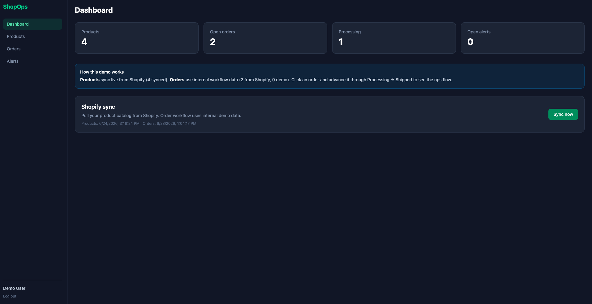
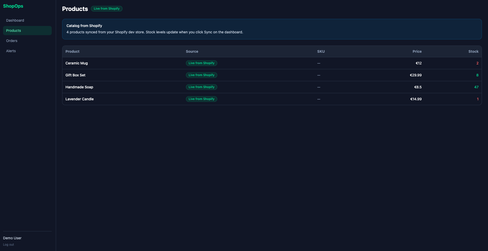
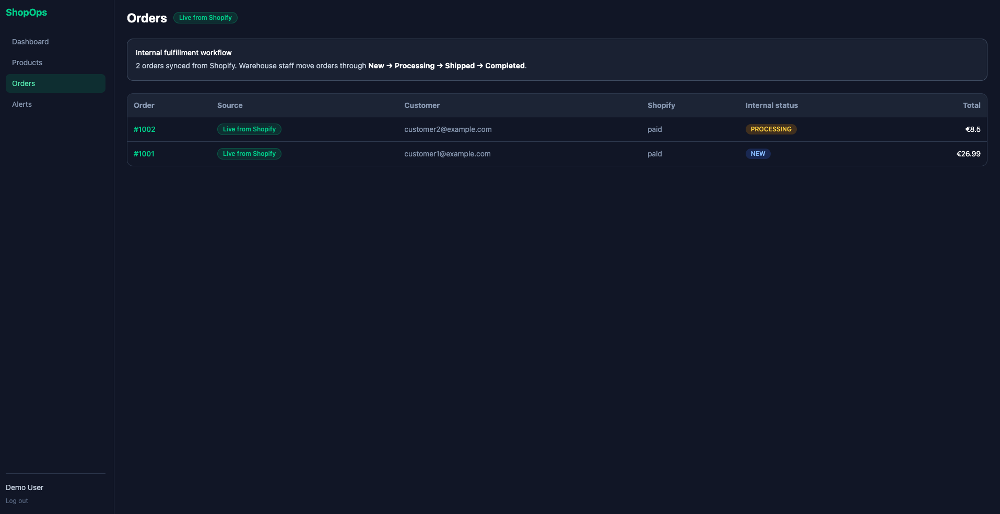

# ShopOps Dashboard

**Internal operations dashboard for e-commerce** — live Shopify product catalog sync, warehouse order workflow, and low-stock alerts.

> Portfolio project demonstrating business application development: domain modeling, workflow automation, and external system integration (Shopify Admin API).

**Status:** Ready to deploy — see [docs/deploy.md](docs/deploy.md)

**Case study:** [docs/portfolio-case-study.md](docs/portfolio-case-study.md) · **Demo script:** [docs/demo-script.md](docs/demo-script.md)

---

## Live demo

| | |
|--|--|
| **App** | _Add your Vercel URL after deploy_ |
| **API** | _Add your Render URL after deploy_ |
| **Login** | `demo@shopops.dashboard` / `DemoShopOps2025!` |

### Screenshots

_Add after deploy — save PNGs to `docs/screenshots/`_

| Dashboard | Products | Orders |
|-----------|----------|--------|
|  |  |  |

---

## The problem

Small e-commerce businesses sell through **Shopify**, but Shopify is built for *selling*, not for *operating*:

- Warehouse staff have no single view of which orders still need shipping
- Low-stock products are easy to miss until a customer orders something unavailable
- Ops teams must log into Shopify admin for tasks that could live in a focused internal tool

## The solution

ShopOps Dashboard sits **next to** Shopify (not replacing it):

```
Shopify (sales)  →  product sync  →  ShopOps (operations)  →  workflow + alerts
```

1. **Sync** product catalog from a Shopify development store (live REST integration)
2. **Track** internal order status: New → Processing → Shipped → Completed
3. **Alert** when product stock drops below a threshold
4. **Label** data sources clearly — live Shopify vs demo workflow data

## Try it locally

```bash
# Backend (requires backend/.env — see backend/.env.example)
cd backend && ./mvnw spring-boot:run

# Frontend
cd frontend && npm run dev
```

Open `http://localhost:5174` and log in with the demo credentials above.

## Deploy (production)

Step-by-step guide (Render + Vercel + Supabase): **[docs/deploy.md](docs/deploy.md)**

| Layer | Host |
|-------|------|
| Frontend | Vercel (`frontend/`) |
| Backend | Render (`backend/Dockerfile`) |
| Database | Supabase PostgreSQL |

## Architecture

| Layer | Technology |
|-------|------------|
| Frontend | React, Vite, Tailwind CSS |
| Backend | Java 21, Spring Boot |
| Database | PostgreSQL (Supabase) |
| External | Shopify Admin API |
| Deployment | Vercel + Render |

See [docs/domain-model.md](docs/domain-model.md) for the data model and [docs/shopify-setup.md](docs/shopify-setup.md) for Shopify credentials.

## Relevance to low-code / Mendix

| Mendix concept | ShopOps implementation |
|----------------|------------------------|
| Domain model | Product, Order, OrderLine, StockAlert, User |
| Microflows | Low-stock check, order status transitions |
| Pages | Dashboard, product list, order detail, alerts |
| REST integration | Shopify Admin API product sync |
| Event handlers | Shopify webhooks (future) |

## Development phases

| Phase | Status | Focus |
|-------|--------|-------|
| 0–5 | ✅ | Domain model, scaffold, auth, CRUD, Shopify sync |
| Portfolio polish | ✅ | Live vs demo labels, case study |
| 8 | ✅ | Deploy config + guides |
| 6–7 | Optional | Webhooks, alert automation |

## Author

Romy van Dam — [GitHub](https://github.com/rooomaisa)
